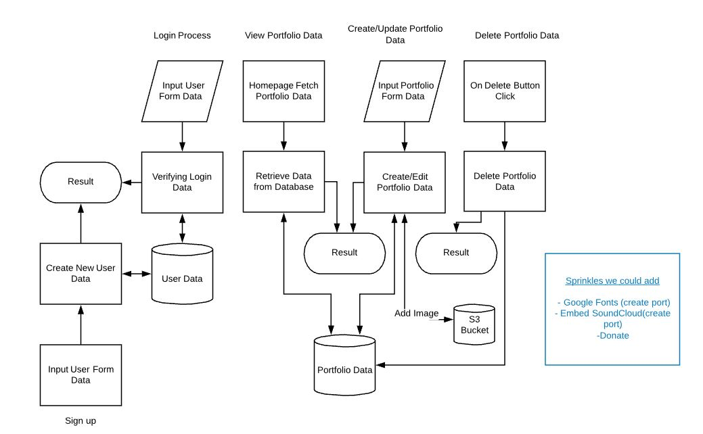
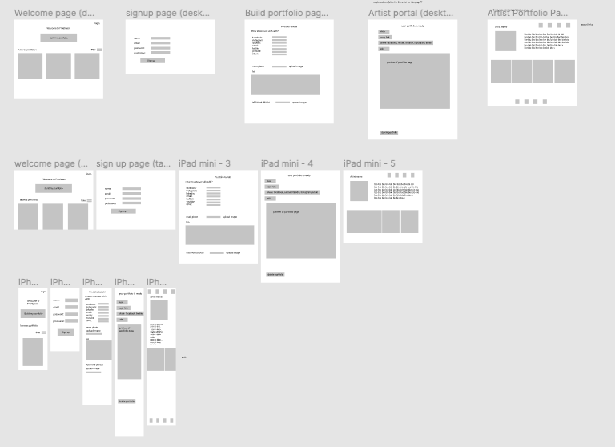
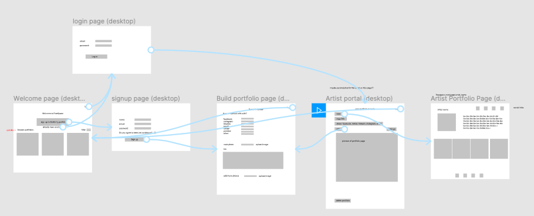
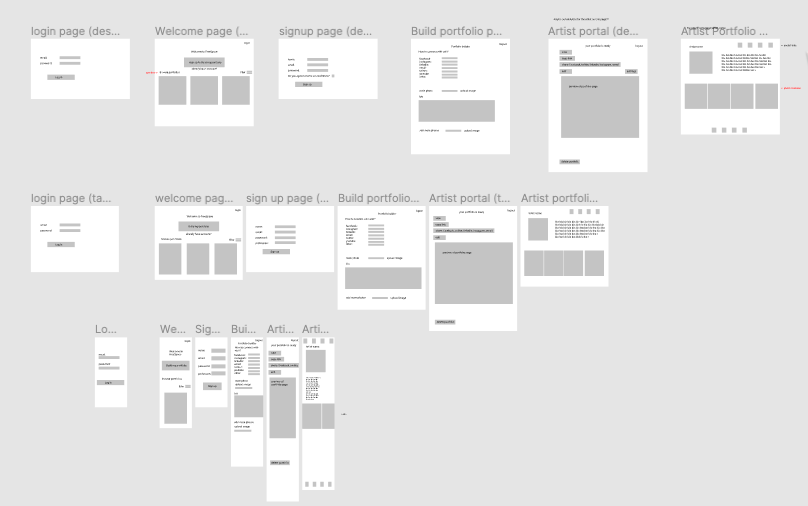
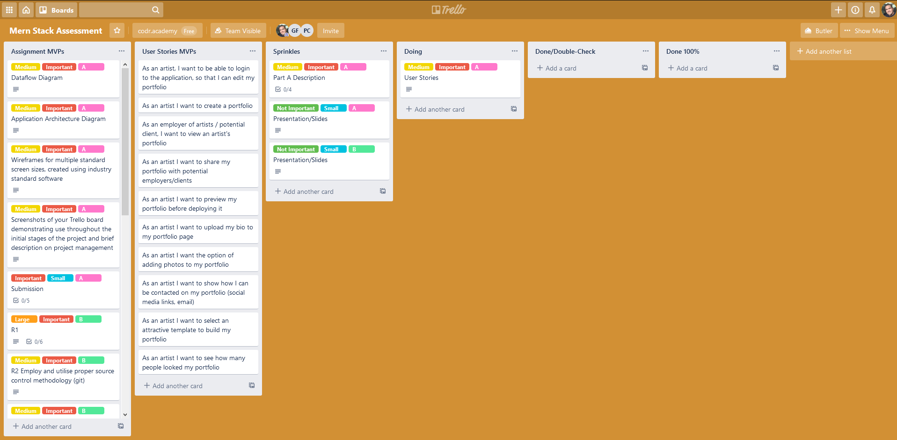
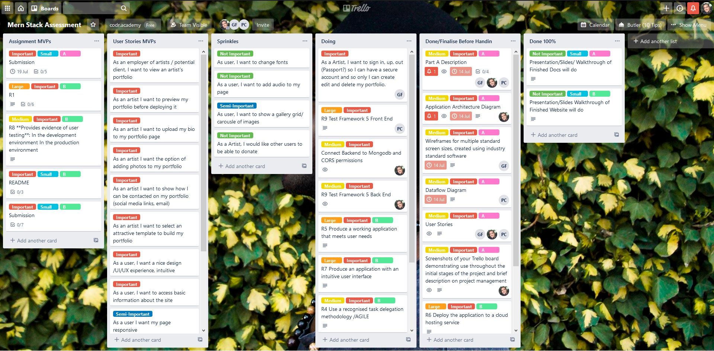
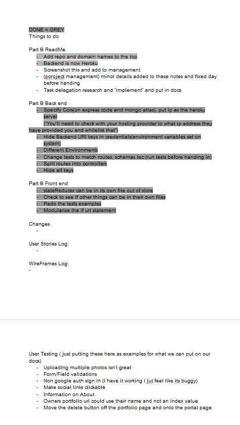

# FreeSpace Portfolio Website
## CA-MERN-Stack-Part-A

T3A2-A MERN Stack Project Part A | Gabby, Pedro, Luke.

- Deployed Front End Site: https://free-space.gq/
- Deployed Back End Site: https://free-space-api.herokuapp.com/
- Github Repo Part A docs: https://github.com/lukelovekin/CA-MERN-Stack-Part-A
- Github Repo Part B Front-End: https://github.com/lukelovekin/FreeSpace-FrontEnd
- Github Repo Part B Back-End: https://github.com/lukelovekin/FreeSpace-BackEnd-Api

#### Purpose

Artists currently pay $16 per month to run a portfolio website on services such as Squarespace.
The purpose of our web app is to provide a free tier to this problem allowing artist to put their portfolio on the internet for free. 
Allowing users to upload, photos, audio and text into set templates provided by our MERN stack application. In the future, users can then upgrade using our services for extra custom features like URLS and add more customisability.

#### Functionality / Features

- Create an account with a secure password
- Authentication upon sign in
- Authorisation.
    - Allowing only owners of portfolios to edit and delete their portfolios
    - Allowing only users signed in to make new portfolios
- The ability to create, read, update and delete portfolios
- View everyone's portfolios on the homepage
- Connect with Artists through their portfolio links/buttons
- Filter portfolios by Actors, Artists, Musicians
- Upload many images to portfolio to help with self promotion
- Upload audio
- Show a Portfolio Preview before Deploying
- Choose custom templates for an online portfolio
- Nice UI/UX design
- Sign up/ Sign out
- Responsive Webpage
- See how many people have seen your portfolio
<!-- Add more if we think of them -->

#### Target Audience

The main target audience for FreeSpace will be Artists, Actors, Musicians and anyone looking to create a deployed portfolio for themselves so they can advertise themselves to potential employers or clients. The other target audience will be Employers, scouts and anyone looking hire these artists for work or gigs or other jobs alike.

#### Tech stack (e.g. html, css, deployment platform, etc)

Main Stack

- Javascript
- MongoDB
- Express JS
- React
- Node JS
- HTML5 / SCSS
- Bootstrap
- VSCode
- Lucid Chart
- Trello

Modules

- Passport
- Axios
- React-Bootstrap
- React-Dom-Router
- Cors
- TBC if more to come (Part B)

Third Party Services

- Netlify (Front End/ Heroku Back end)
- Github
- AWS S3 Bucket
- Google Authentication
- Stripe 

## Dataflow Diagram

Initial MVP DataFlow Diagram (12am 14th July)

Notes: 
- Update as/if Apps/ Middleware/ Third Parties get added

## Application Architecture Diagram

Initial Application Architecture Diagram (3.20pm 13th July)

Notes: 
- Update as/if Apps/ Middleware/ Third Parties get added

## Wireframes

Wireframes were built using figma.com and regularly updated to keep up with our agile methodology.

Link to complete wireframes: https://www.figma.com/file/UV2ORPDQHDbOpmktAvAJfv/Untitled?node-id=0%3A1

First draft of wireframes (9am 13th July)

Notes:
- revise industry standard UI/UX
- complete relationships between screens
- focus on  space distribution, content prioritisation, and users intended actions
- add navbar for: sign up, login, home, logout

Desktop version updated (5pm 13th July)

This version is complete prototyping and features for desktop version. Logout buttons added to most pages.
Notes:
- need to also complete desktop and mobile versions
- more design and color elements may be nice to add if time permits 

Complete Wireframes (10am 14th July)

Prototyping for all screen sizes complete. Mobile and tablet logout buttons added. Login page added to mobile and tablet. Some annotations added for more clarity.

## User Stores

Initial MVP User Stories

- As an artist, I want to be able to login, so that I can create edit and delete my portfolio
- As an artist I want to create an account and portfolio, so I can advirtise my art/music/acting experience
- As an employer / potential client, I want to view an artist's portfolio to see their work
- As an artist I want to preview my portfolio before deploying it to make sure it looks good
- As an artist I want to upload my bio to my portfolio page so people can read about my career
- As an artist I want the option of adding photos to my portfolio to show my work/headshots/band members
- As an artist I want to show how I can be contacted on my portfolio (social media links, email) to share and expand my network
- As an artist I want to select an attractive template to build my portfolio so I can make my portfolio look good
- As an artist I want my account to have a Secure Login so my information can't be changed or destroyed
- As a user, I want a nice design intuitive /UI/UX experience
- As a user, I want to access basic information about the site to make sure how it works
- As a Artist I want my page responsive so the web page will display nicely and will provide a quality user experience

 Initial Sprinkle User Stories

- As a user, I want to choose a filter of actors, artist, musicians to view only
- As an artist I want to share my portfolio with potential employers/clients so I can expand my work
- As an artist I want to see how many people looked my portfolio so I can an idea of how many people are looking at my portfolio

Added MVP User Stories

- TBC

Added Sprinkle User Stories

- TBC

## Project Management

Trello Board Link: https://trello.com/b/vcGGvVN7/mern-stack-assessment

Starting with the planning stage of the project, after thoroughly going over the criteria of the assignment and Rubrik, Our team started with Minimum Viable Product (MVP) ideas. Starting with a Trello board, We split up the assignment's MVP requirements into To-Do cards as well as MVP user stories. The cards include checklists, dates to be completed as well as colour coded labels (red being MVP, most important) to highlight their importance as well as their difficulty/time cost. After the Trello board we set up and layout our Git Repositories adding each of the group users ready for collaborationa and rest of the project. 

Our team refers back to the Trello board at least every morning and afternoon, if not every time we finish a tasks.  Most important cards are discussed first and ee move cards that we aim to do on that day into the "Doing" column, move cards into the "Done" column when they are complete as well as constantly adding more User Stories and To Dos to their columns to at least aim to complete.

Throughout the day, things that come into mind that will need doing or may cause errors, later on, are noted via a shared Google Docs, commented on in our shared repository and even added to the Trello in the appropriate area.

Trello Screenshots

Planning Stage

Day 1

Last day of Part A

Shared notes, Google Docs

